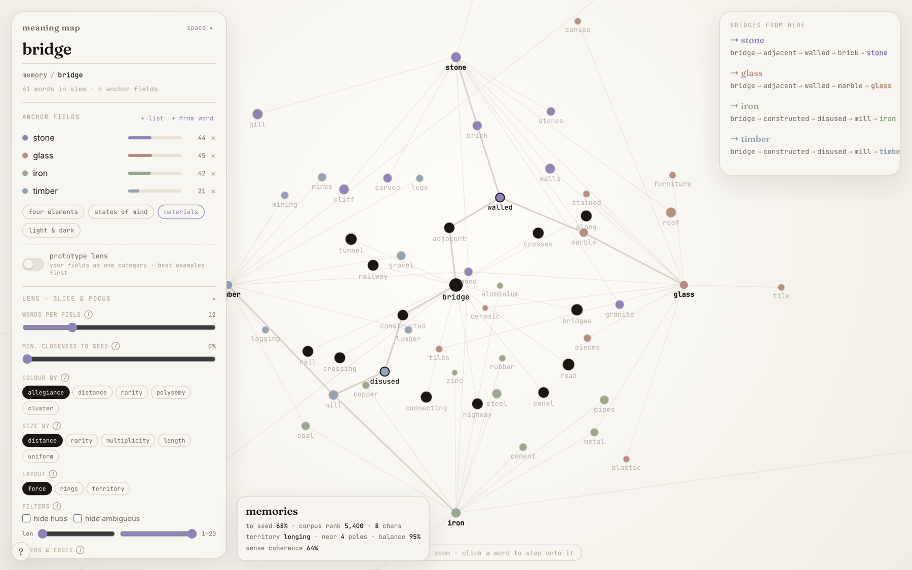

# Isthmus


**A word can sit between two ideas without belonging to either. This finds it.**

Stand on a word. Name a few meaning-fields you want to reach. Isthmus grows a small
neighbourhood cloud outward from your word *and* from each field at once, finds where the
clouds genuinely overlap — not just where they both happen to touch a generic hub word — and
draws the shortest honest chain between them. Every hop is checked against real vector
distance, so it can't claim progress that isn't there.

It started as a tool for naming a website. What survived is the part that turned out to be
interesting: triangulating between several meanings simultaneously, in a dense vector space
that has no natural clusters to lean on.



*Standing on **bridge**, triangulating against the fields **stone**, **glass**, **iron**,
**timber** — note the bridge path the tool actually found to `iron`: `bridge → constructed →
disused → mill → iron`, via an old mill, not a straight line.*

---

## Why "Isthmus"

An isthmus is the narrow strip of land that joins two larger landmasses — not part of either,
but the only way to walk from one to the other. That's exactly what the tool's bridge words
are: not a hub that every neighbourhood happens to share, but the specific, narrow, genuine
connective tissue between two fields of meaning.

## How it works

The database is dense: every word has *some* cosine similarity to every other word, and the
similarity falloff is a smooth slide with no natural knee. There's no stored "neighbourhood" to
retrieve — any cutoff is arbitrary by construction. So instead of ranking a fixed top‑k, the
tool runs a small search:

1. **Cloud** — a word's neighbourhood is its *k* nearest neighbours by cosine similarity.
   Expanding two hops from the current word, and from each anchor field, builds a small cloud
   around each.
2. **Meeting node** — intersect the current word's cloud with each anchor's cloud. The naive
   overlap is junk — frequent hub words ("thing", "system") sit in *everyone's* neighbourhood —
   so candidates are scored instead:

   ```
   spec(word)   = clip(log1p(rank) / log1p(N), 0.15, 1.0)              # rare words score near 1, hubs near 0.15
   bridge(n)    = min(cs, as) * (0.5 + 0.5 * (1 - |cs - as|)) * spec(n) # cs, as = cosine(current, n), cosine(anchor, n)
   ```

   The `min` term rewards being close to *both* ends; `1 - |cs - as|` rewards sitting genuinely
   *between* them rather than in the anchor's back yard; `spec` keeps hub words out. Both terms
   are load-bearing — checked against real data, not assumed. Drop either and the bridges
   collapse onto junk.
3. **Skeleton** — walk the k-NN graph greedily from the current word to the chosen bridge, then
   from the bridge to the anchor, picking at each step the neighbour maximising
   `cosine(candidate, target) * (0.6 + 0.4 * spec(candidate))`. The two legs joined are the
   drawable path.
4. **Proximity gauge** — each anchor shows the raw cosine similarity from wherever you're
   standing, live, as a percentage. It measures real distance, so stepping onto a bad bridge
   shows up immediately as a gauge that doesn't move.
5. **Sense-split flag** — if a bridge word's own neighbourhood is internally incoherent (its top
   neighbours don't agree with each other), it's likely polysemous and the route may not mean
   what it reads. The tool surfaces this rather than hiding it.

Validated against real GloVe vectors, cross-checked between the JS engine and a Python
reference implementation (`app/engine.py`, `app/refine.py`):

| Chain | Note |
|---|---|
| `shadow → planet → planets → earth → ocean` | clean hop, no flag — astronomical register |
| `threshold → absolute → utter → disbelief → silence` | clean hop, no flag — moral-abstraction register |
| `storm → thunderstorm → bursts → gunfire → fire` | **sense flag fires** — "fire" genuinely splits flame/gunfire here |

## Features

- **Multi-anchor triangulation** — not just nearest-neighbour lookup; find what's genuinely
  between several fields at once.
- **Live proximity gauges** — real cosine distance to every anchor, updating as you move.
- **Polysemy detection** — flags bridge words whose own neighbourhood doesn't agree with itself.
- **A control panel, not a fixed view** (`meaning_map_v9.html`) — every slice of the graph is a
  `dimension × verb`: **filter** (hide), **group/layout** (partition), **encode** (colour/size).
  Words-per-field cutoff, minimum closeness, colour-by [allegiance / distance / rarity /
  polysemy / cluster], size-by, three layout modes, hub/ambiguity filters, edge styles — all
  free, all computed straight from the vectors, no external data needed.
- **Offline-first** — the vector space loads once and is cached in IndexedDB; every session
  after that works with no network at all.
- **Swappable vocabulary** — the vector space is one self-describing binary file. Drop in a
  different one (different language, larger vocabulary, higher dimensionality) with no code
  changes.
- **Zero dependencies** — no build step, no framework, no bundler. It's HTML files you can open.

## Quickstart

```bash
git clone https://github.com/almostonpurpose/isthmus.git
cd isthmus/app
python3 -m http.server
# then open http://localhost:8000/meaning_map_v9.html
```

On macOS, double-clicking `app/launch.command` does the same thing and opens the browser for
you. Opening the HTML file directly (no server) also works — the first run needs you to drop
`space.bin` onto the panel once, since browsers block local file fetches; after that it's
cached and loads itself.

## Under the hood

A few things this project was a genuine excuse to build properly:

- **A custom binary vector format.** `space.bin` is one self-describing file — magic bytes,
  version, dimensions, vocab size, a dequantisation scale, then the words and int8-quantised
  vectors. 40,000 words × 50 dimensions in ~2.3 MB. Full format spec and the packer in
  [`app/HANDOVER.md`](app/HANDOVER.md).
- **A hand-rolled force-directed graph**, no d3 / three.js / any rendering library. Naive O(n²)
  repulsion, current word pinned to centre, anchors pinned to a ring, skeleton edges pulling
  harder so the chain visibly lays out between endpoints.
- **Dual-implementation validation.** The bridge-scoring and pathfinding logic exists twice —
  once in the shipped JS engine, once in a Python reference implementation — and was
  cross-checked to agree on real data before being trusted.
- **Offline persistence done right.** IndexedDB for the binary payload, not localStorage; a
  three-tier load order (cache → bundled fetch → manual drop) that degrades gracefully under
  `file://`.

## Project structure

```
isthmus/
├── app/                    the tool
│   ├── meaning_map_v9.html    current version — full control panel
│   ├── meaning_map_v8.html    prior version — documented in HANDOVER.md
│   ├── field_inspector.html   companion view: one field's neighbourhood, close up
│   ├── space.bin               the semantic space (GloVe 6B 50d, 40k words, int8-quantised)
│   ├── words.txt, meta.json    plain-text vocabulary + space metadata (used by the Python reference)
│   ├── engine.py, refine.py    Python reference implementation, validated against the JS engine
│   ├── launch.command          macOS double-click launcher
│   └── HANDOVER.md             full technical write-up: algorithm, file format, design tokens,
│                                known limits, recommended next steps
├── archive/                superseded prototypes and iteration history, kept for reference
└── docs/                   README assets
```

## Known limitations

- **Resolution** — 50 dimensions is coarse; very short hops can collapse to their endpoints. A
  denser space (100d) is a file swap, not a code change.
- **Vocabulary** — the 40,000 commonest English words. Rare or technical terms won't resolve.
- **Sense bias** — a word resolves to its dominant corpus sense (GloVe has no sense
  disambiguation). The sense-split flag surfaces this; it doesn't fix it.
- **Fonts** — Fraunces / Inter / JetBrains Mono load from Google Fonts; offline it degrades to
  system fonts.

## Roadmap

1. A 100-dimensional space, for sharper hops (highest value, lowest risk — a file swap).
2. Fold the earlier hex/gravity-field view (`archive/tld_explorer_7.html`) back in as a
   close-up single-word lens, alongside the graph as the wide-angle view.
3. A cross-linguistic fork — drop in a second language's vector space and surface where the two
   languages' fields *fail* to overlap, rather than translating between them.

## Credits

Built on GloVe 6B 50d word vectors (Pennington, Socher, Manning — Stanford NLP). Source vectors
are Common Crawl / Wikipedia GloVe; the tool ships no model, only the static, quantised vectors
in `space.bin`.

## License

[MIT](LICENSE)
